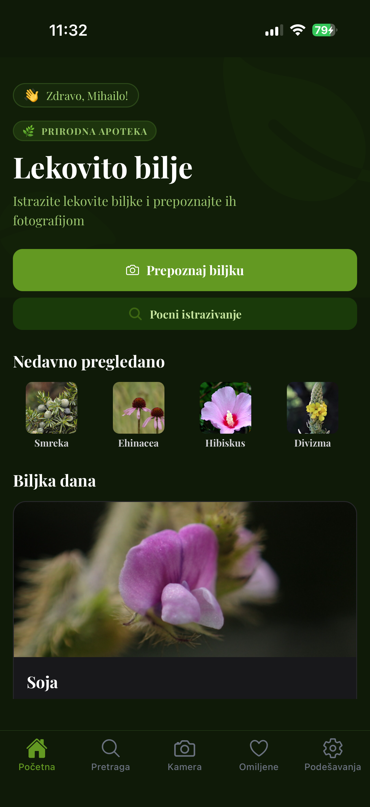
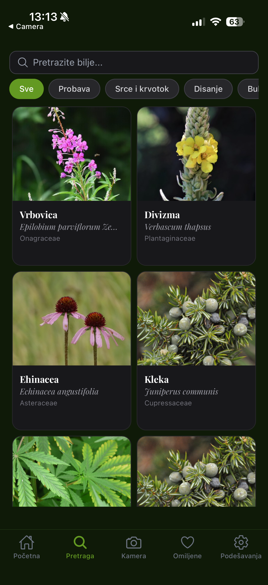
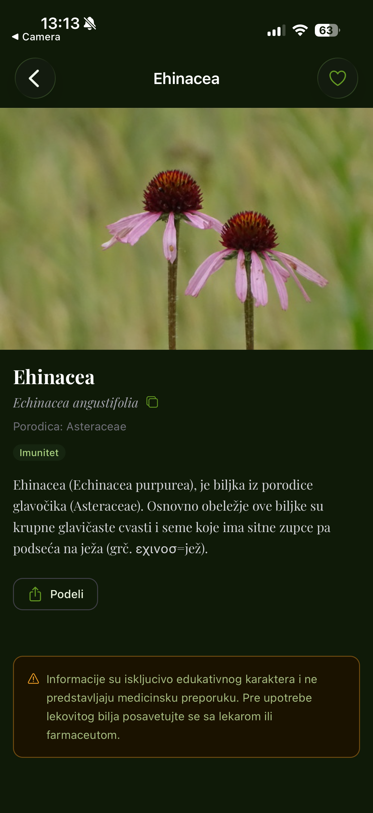
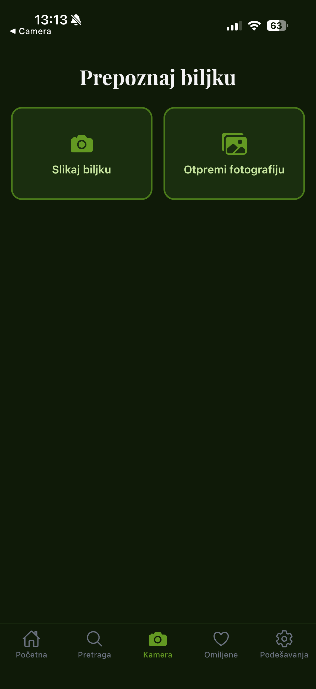
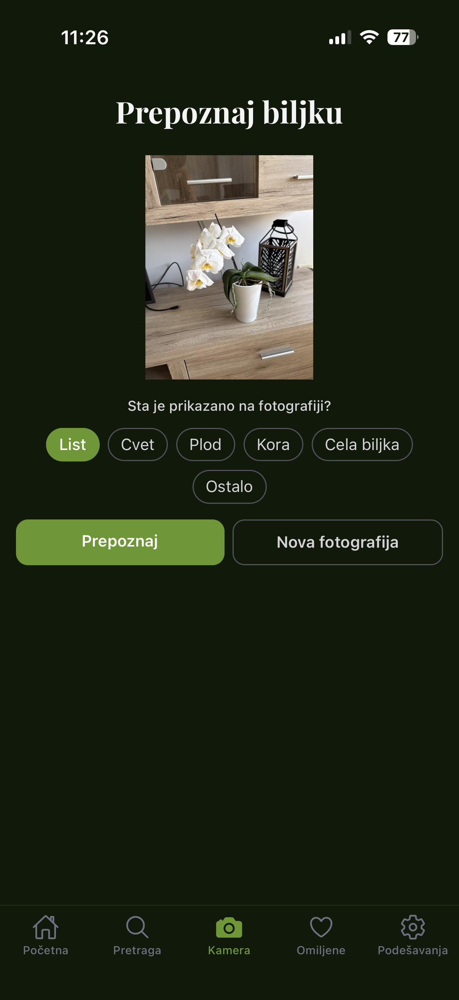
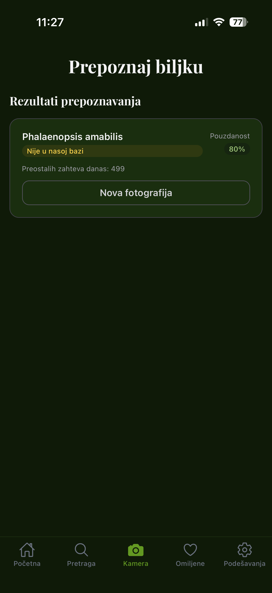
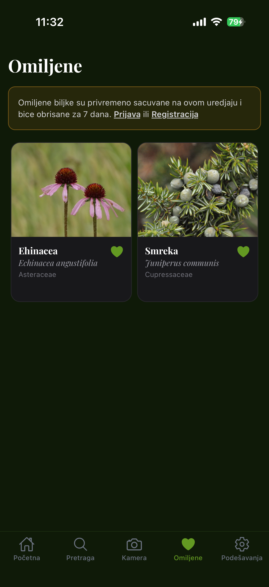
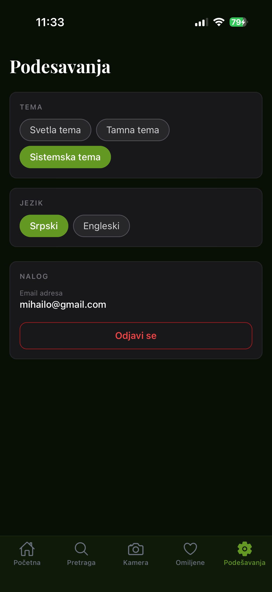

# Lekovito Bilje

A mobile application for identifying and exploring medicinal plants. Users can recognize plants by photo, search by name or therapeutic use, and save favorites — with or without an account.


---

## Screenshots

| Početna | Pretraga | Detalji biljke |
|:---:|:---:|:---:|
|  |  |  |

| Prepoznavanje | Sa slikom | Rezultat |
|:---:|:---:|:---:|
|  |  |  |

| Omiljene | Podešavanja |
|:---:|:---:|
|  |  |

---

## Features

- **Plant recognition** — identify a plant by taking a photo or uploading one from the gallery
- **Search** — search by name or filter by therapeutic use (digestion, respiratory, skin, etc.)
- **Plant details** — images with pagination indicator, usage, warnings, and share
- **Favorites** — save plants as a guest (stored locally for 7 days) or as a logged-in user
- **Authentication** — sign in or register via Supabase Auth
- **Dark mode** — full dark/light theme support, follows system preference
- **Multilingual** — Serbian and English (i18n)

---

## Tech Stack

| | |
|---|---|
| Framework | Expo SDK 54, React Native 0.81.5, React 19.1.0 |
| Navigation | Expo Router 6 |
| Styling | NativeWind 4 + Tailwind CSS 3 |
| Backend | Supabase (auth + database) |
| State management | Zustand 5 |
| Data fetching | TanStack Query v5 |
| Internationalization | i18next + react-i18next (sr / en) |
| List rendering | FlashList |
| Image handling | expo-image, expo-image-picker |
| Fonts | Playfair Display (Google Fonts) |
| Validation | Zod |

---

## Getting Started

### Prerequisites

- [Node.js](https://nodejs.org/) 18+
- [Expo Go](https://expo.dev/go) app on your phone (iOS or Android)

### Installation

```bash
git clone https://github.com/MihailoRadulovic/Diplomski.git
cd Diplomski
npm install
```

### Environment variables

Create a `.env` file in the root of the project:

```env
EXPO_PUBLIC_SUPABASE_URL=your_supabase_project_url
EXPO_PUBLIC_SUPABASE_ANON_KEY=your_supabase_anon_key
EXPO_PUBLIC_VERCEL_API_URL=your_api_url
```

| Variable | Description |
|---|---|
| `EXPO_PUBLIC_SUPABASE_URL` | Supabase project URL |
| `EXPO_PUBLIC_SUPABASE_ANON_KEY` | Supabase anonymous (public) key |
| `EXPO_PUBLIC_VERCEL_API_URL` | API endpoint for plant recognition |

### Run

```bash
npx expo start
```

Scan the QR code with Expo Go on your phone.

---

## Project Structure

```
app/
  _layout.tsx               # Root layout — fonts, providers, navigation
  (tabs)/                   # Bottom tab navigation
    index.tsx               # Home screen
    pretraga.tsx            # Search screen
    prepoznavanje.tsx       # Recognition screen
    omiljene.tsx            # Favorites screen
    podesavanja.tsx         # Settings screen
  (auth)/                   # Auth screens (modal)
    prijava.tsx             # Sign in
    registracija.tsx        # Register
  biljka/[slug].tsx         # Plant detail screen

components/
  biljke/                   # BiljkaKartica, OmiljenaToggle, BiljkaDetalji, UpozorenjaSekcija
  pocetna/                  # PocetnaHero, BiljkaDanaSekcija, NedavnoPregledano
  pretraga/                 # PretragaInput, PretragaFilteri, PretragaRezultati
  prepoznavanje/            # PrepoznavanjeLoader, PrepoznavanjeRezultat
  ui/                       # Badge, Disclaimer, Skeleton, Spinner, Toast
  empty/                    # EmptyState
  error/                    # ErrorFallback

hooks/                      # useAuth, useBiljka, useBiljkaDana, useImagePicker,
                            # useNedavnoPregledano, useOmiljene, usePrepoznavanje,
                            # usePretraga, useT, useTheme

stores/                     # jezikaStore, pretragaStore, temaStore (Zustand)

lib/
  supabase/client.ts        # Supabase client
  constants/                # Fonts, filter tags
  utils/                    # guestOmiljene, nedavnoPregledano
  validations/              # upload.schema.ts (Zod)

types/                      # biljka.ts, database.ts
messages/                   # sr.json, en.json (translations)
i18n/index.ts               # i18next configuration
```

---

## Database Schema (Supabase)

| Table | Key columns |
|---|---|
| `biljke` | `id`, `srpski_naziv`, `latinski_naziv`, `slug`, `porodica`, `opis`, `delovanje`, `plantnet_nazivi[]` |
| `biljka_slike` | `id`, `biljka_id`, `url`, `alt_tekst`, `je_glavna` |
| `biljka_upotrebe` | `id`, `biljka_id`, `deo_biljke`, `nacin_upotrebe`, `za_sta` |
| `biljka_upozorenja` | `id`, `biljka_id`, `lek`, `opis_interakcije`, `ozbiljnost` (`niska`\|`srednja`\|`visoka`) |
| `omiljene` | `id`, `user_id`, `biljka_id`, `deleted_at` — `user_id` set automatically via RLS (`auth.uid()`) |

Full types: [`types/database.ts`](./types/database.ts)

---

## Plant Recognition API

**Endpoint:** `POST {EXPO_PUBLIC_VERCEL_API_URL}/api/prepoznavanje`

**Request:** `multipart/form-data`

| Field | Type | Description |
|---|---|---|
| `image` | file | JPEG / PNG / WebP, max 10 MB |
| `organ` | string | `leaf` \| `flower` \| `fruit` \| `bark` \| `habit` \| `other` (default: `leaf`) |

**Response:** `{ data: PrepoznavanjeOdgovorData }`

```ts
// Plant found in the database
{ tip: "u_bazi"; slug: string; naziv: string; latinskiNaziv: string; pouzdanost: number; preostalihZahteva: number }

// Plant recognized but not in the database
{ tip: "nije_u_bazi"; naziv: string; pouzdanost: number; preostalihZahteva: number }

// Unrecognized
{ tip: "nije_prepoznato" }
```

The server retries PlantNet 3 times internally — no client-side retry needed.

---

## Development Notes

These conventions apply throughout the codebase:

**Fonts** — always use constants from `lib/constants/fontovi.ts`, never hardcoded strings:
```ts
import { SERIF_BOLD, SERIF_ITALIC, SERIF_REGULAR } from '@/lib/constants/fontovi.ts';
// SERIF_BOLD    → 'PlayfairDisplay-Bold'
// SERIF_ITALIC  → 'PlayfairDisplay-Italic'
// SERIF_REGULAR → 'PlayfairDisplay-Regular'
```

**Dark mode** — every component must include `dark:` NativeWind variants at the time of writing, never added later.

**Auth routes** — always use `/(auth)/prijava` and `/(auth)/registracija`, never `/prijava`.

**Search filtering** — filters go through `delovanje.ilike('%value%')`. The `tagovi` column exists in the DB but is not used for filtering.

**Supabase** — called directly from hooks, no API layer in between. Client is at `lib/supabase/client.ts`.

---

## License

MIT — Copyright (c) 2025 Mihailo Radulovic
